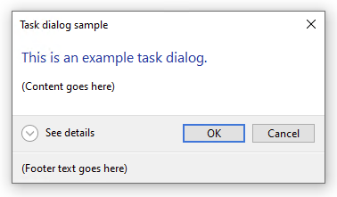
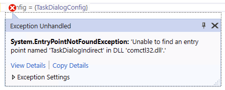

## WPF System.EntryPointNotFoundException: Unable to find an entry point named 'TaskDialogIndirect' in DLL 'comctl32.dll'

Calls to `comctl32.dll` succeed in .NET Framework 4.8, but fail in .NET 5 and in .NET Core 3.1 with `System.EntryPointNotFoundException`

```csharp
[DllImport("comctl32.dll", PreserveSig = false)]
private static extern void TaskDialogIndirect([In] ref TaskDialogConfig pTaskConfig, out int pnButton,
    out int pnRadioButton, [MarshalAs(UnmanagedType.Bool)] out bool pfVerificationFlagChecked);
```

### :white_check_mark: .NET Framework 4.8 | `net48`



### :x: .NET Core 3.1 | `netcoreapp3.1`



### :x: .NET 5 (Windows) | `net5.0-windows`


## Workaround .NET Core 3.1 & .NET 5

The workaround is for the application host to add an `app.manifest` file declaring the dependency on `comctl32.dll`.

**app.manifest**
```xml
<?xml version="1.0" encoding="utf-8"?>
<assembly manifestVersion="1.0" xmlns="urn:schemas-microsoft-com:asm.v1">
  <!-- Enable themes for Windows common controls and dialogs (Windows XP and later) -->
  <dependency>
    <dependentAssembly>
      <assemblyIdentity
          type="win32"
          name="Microsoft.Windows.Common-Controls"
          version="6.0.0.0"
          processorArchitecture="*"
          publicKeyToken="6595b64144ccf1df"
          language="*"
        />
    </dependentAssembly>
  </dependency>
</assembly>
```

**WpfApp.csproj**
```xml
<Project Sdk="Microsoft.NET.Sdk">

  <PropertyGroup>
    <OutputType>WinExe</OutputType>
    <UseWPF>true</UseWPF>
    <ApplicationManifest>app.manifest</ApplicationManifest>
    <!-- ... -->
  </PropertyGroup>

</Project>
```
